# How to make Character Control with Unity Visual Scripting 

After learning about visual scripting, we will now move on to a project that utilizes this feature. On this occasion, we will create character movement without writing a single line of code.
The visual scripting feature provided in Unity version 2021.2 allows us to design game logic in a more intuitive way. 

Through this, we can create character behavior in our game by simply dragging and dropping the appropriate nodes. If you are using a Unity version below 2021.2, this visual scripting feature will not be available as a built-in tool and will need to be installed separately through the Unity Asset Store.

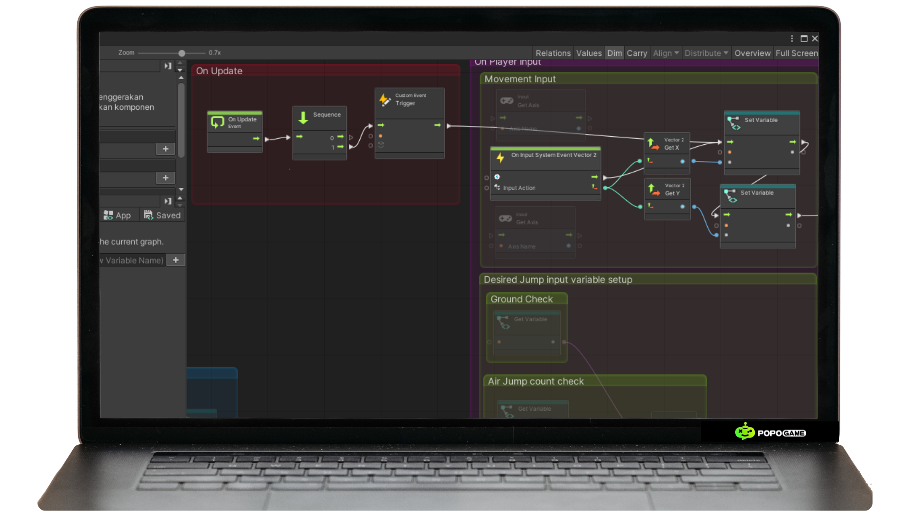

With visual scripting, we can easily set up character movements, from walking to jumping, using just a few simple nodes. This process not only makes it easier for those without a programming background but also speeds up the overall game development process. Let’s start exploring the capabilities of visual scripting and see how far we can take our characters in the game world we create!

## Preparing the Scene

Before applying visual scripting, we need to prepare the scene and the game objects where visual scripting will be implemented. First, we will create a new scene by right-clicking on the project file -> Create -> Scene.

After the scene is created, enter the scene and add game object elements as shown below to the scene hierarchy. Below is an explanation of the functions of the game objects and components, as well as how to add them.

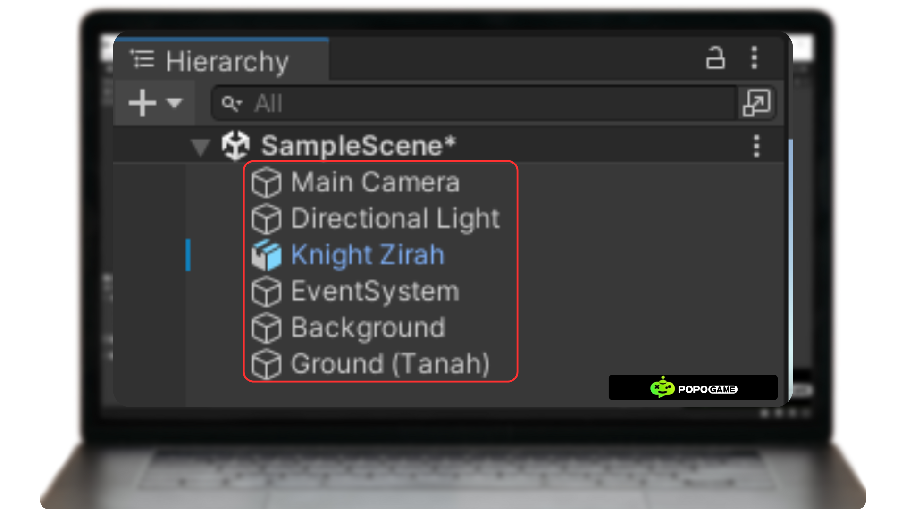

**1. Main Camera:** By default, this will already exist in the hierarchy. The function of the Main Camera is to serve as the primary camera in the scene you are managing. All movements captured by this camera will be displayed in the Game tab. If it does not exist, you can add it by right-clicking on the hierarchy -> Camera.
**2. Directional Light:** By default, this will also exist in the hierarchy. The function of Directional Light is to provide lighting to the scene you are managing. If it is not in the hierarchy, you can add it by right-clicking on the hierarchy -> Light -> Directional Light.
**3. Knight Zirah:** This is the character or game object where you will apply visual scripting for character movement. You can also apply it to 3D game objects provided directly by Unity, such as a cube. You can add it by right-clicking on the hierarchy -> 3D Object -> Cube.
**4. Event System:** The Event System in Unity manages input from various sources, determines the objects being pointed to by the pointer through raycasting, and delivers events to objects in the scene so they can respond correctly to the input. You can add it by accessing GameObject -> UI -> Event System.
**5. Background and Ground:** You can create the background and ground using cubes or planes by right-clicking on the hierarchy -> 3D Object -> Cube or Plane.

## Applying Rigidbody and Collider

Before applying visual scripting, the first step is to add a Rigid Body component to the game object. This component serves to provide physical characteristics to the game object, such as gravity, mass, and the ability to interact with forces and collisions. By attaching a Rigid Body, the object can move and react according to the laws of physics within the game engine, creating a more realistic experience for the user.

We add a Mesh Collider to the background and ground by pressing the "Add Component" button and typing Mesh Collider or Box Collider. Colliders in Unity are used to detect collisions or physical interactions between objects in the game, so the character will not fall through the ground.

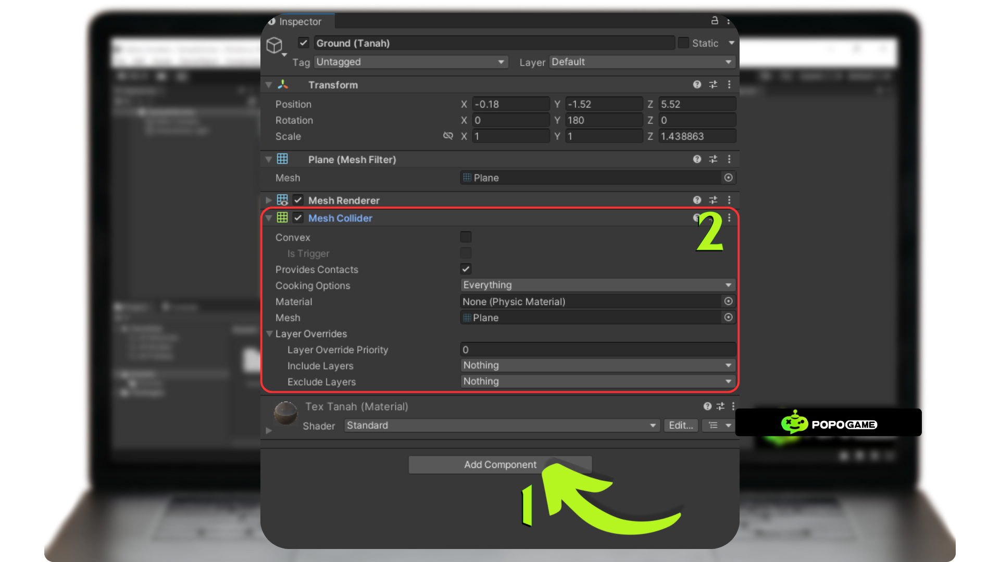

Next, we add a Rigid Body and a Mesh Collider to the Knight Zirah (3D Object) by pressing the "Add Component" button and typing Rigidbody and Mesh Collider into your 3D Object components.

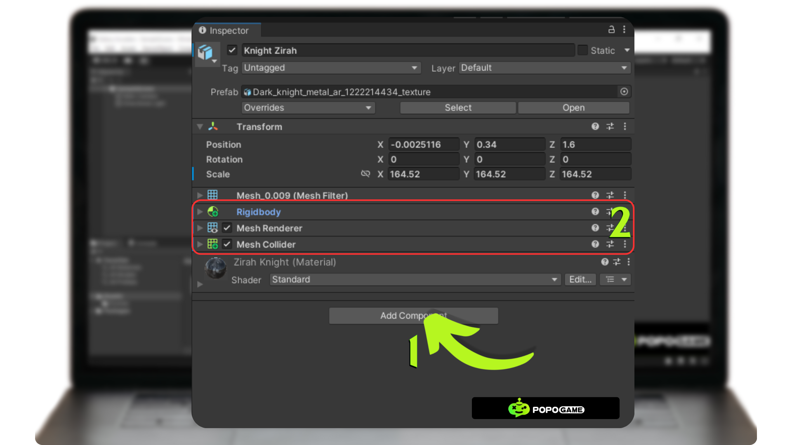

Next, we need to create a Physic Material first to store the friction values that will be applied to the 3D GameObject. This allows the 3D object to move more easily by reducing the friction between the object and the ground. You can add Physic Material by left-clicking on the project file -> Create -> Physic Material.

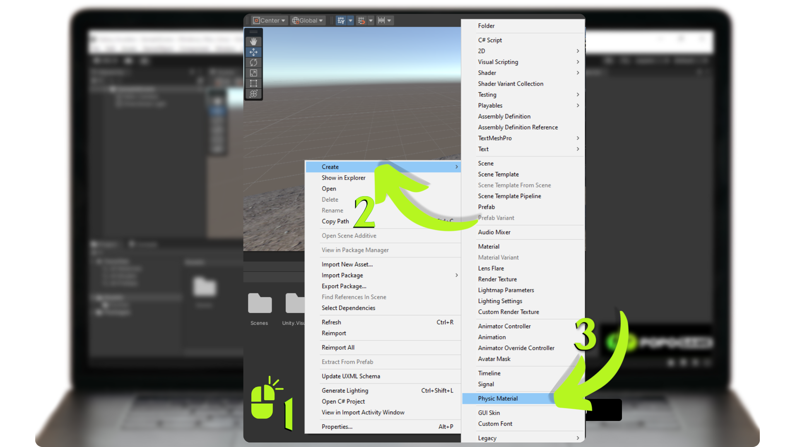

Next, we need to adjust the friction value provided by the Physic Material by setting it to 0. Then, change the Friction Combine and Bounce Combine settings to Multiply.

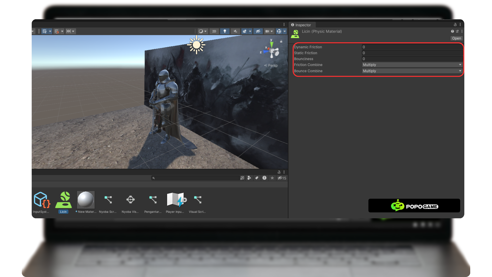

Now, let's go back to the inspector of the 3D Game Object. Here, we will adjust the settings for the Rigidbody and Mesh Collider. Click on the 3D Game Object you previously added, then go to the inspector. Next, modify the Rigidbody and Mesh Collider settings as shown below.

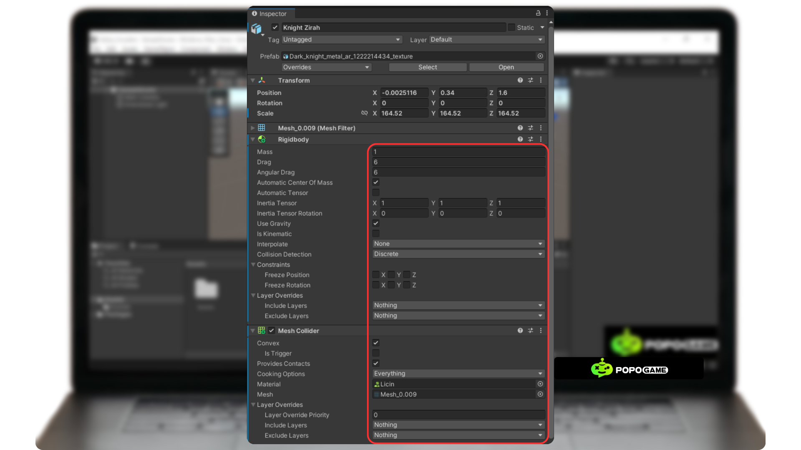

For the Physic Material you created earlier, drag and drop it into the Material field of the Mesh Collider component.

## Visual Scripting 

After all the preparations are complete, we will create a visual script to move the 3D Game Object or character you want to control. You can add visual scripting to your project file by left-clicking on the project file -> Create -> Visual Scripting -> Script Graph. Then, give it a name that matches the script you will edit.

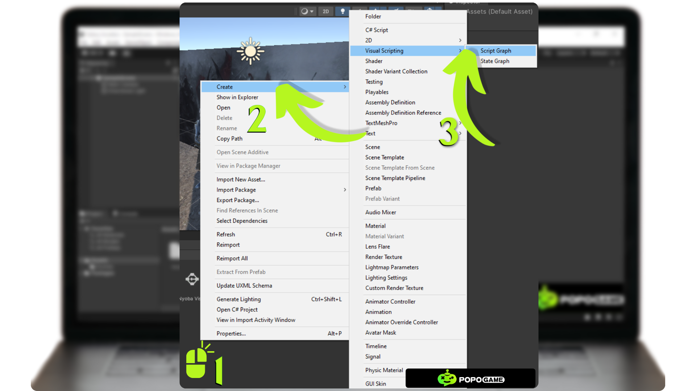

After the Visual Scripting has been created, find the 3D Game Object or character component you made by pressing the Add Component button in the inspector, then type Script Machine. Once the Script Machine is added, the next step is to drag and drop the Script Graph you created into the Graph field of the Script Machine.

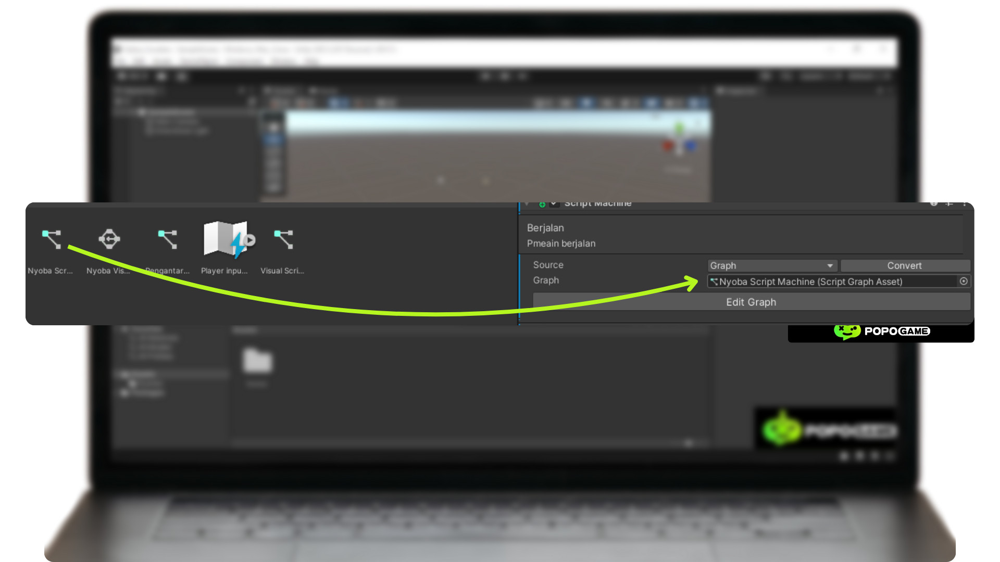

We will not edit the graph immediately; instead, we will prepare the variables first. Check whether the Variables component is already attached to the 3D Game Object character. If not, you need to add the Variables component by pressing the Add Component button in the inspector. Next, add the variables Speed and Gravity as shown in the image below. The values do not have to be the same; adjust them according to your preferences.

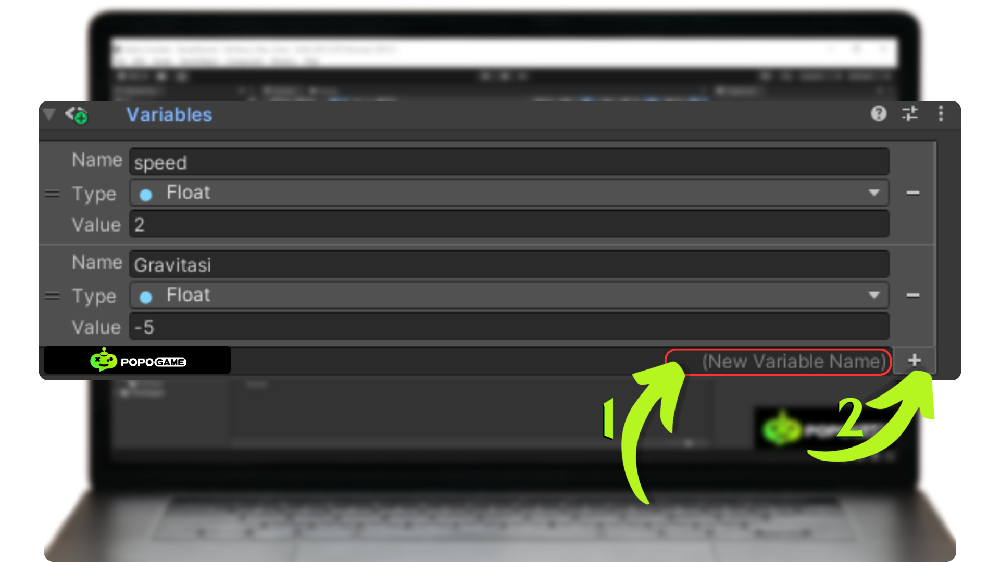

After the variables and their values have been created, the next step is to add the Player component by pressing the Add Component button and typing Player Input. Next, we need to create an action in Player Input. We will create a Jump action so that the character can jump when the player presses the spacebar on the keyboard.

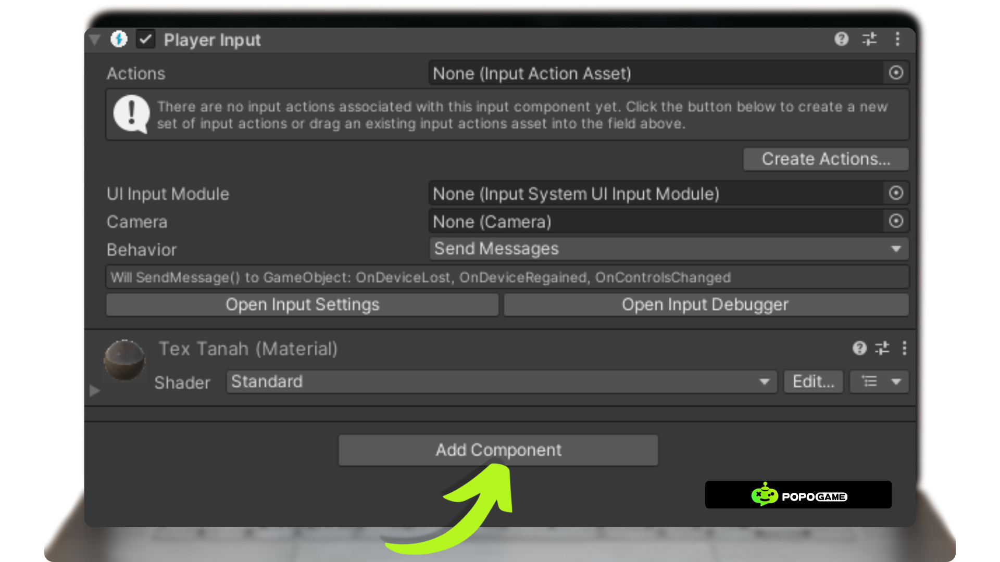

By default, the Move, Look, and Fire actions are already provided, but let's add one more action: Jump. Right-click on the Action word or click the plus sign on the action row. Next, we will add the binding for the Jump action by typing < Keyboard >/space in the Path and also checking the Keyboard & Mouse box.

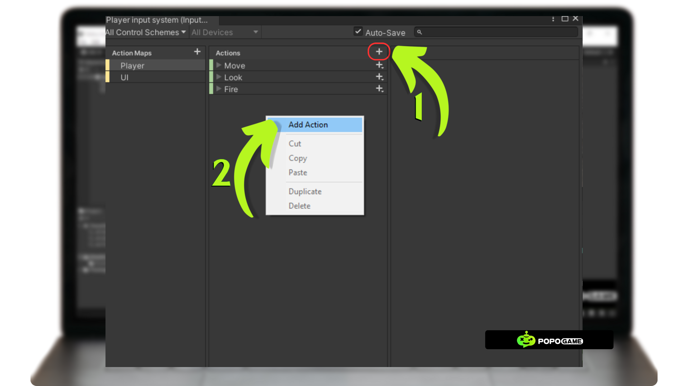

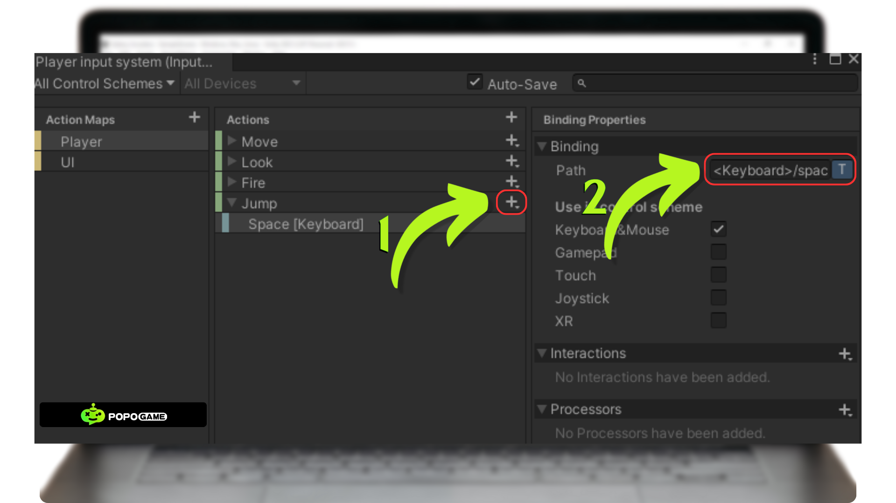

## Nodes in Unity Visual Scripting

Nodes are the basic elements in the graphical representation of programming logic used to build flows or functions in a game or application. Nodes function like building blocks that connect functions or operations, without the need for direct code writing.

**A Simple Explanation of Nodes:**

- Nodes are visual blocks that represent specific actions, logic, or data.
- Each node has a specific function, such as initiating an action, setting a value, calling a function, or retrieving data.
- Nodes are connected to each other using wires to create a flow of logic.

**Basic Components of Nodes in Unity Visual Scripting:**

1. Input Ports
- The place where a node receives data or signals from other nodes.
- Usually on the left side of the node.
2. Output Ports
- The place where a node sends data or signals to other nodes.
- Usually on the right side of the node.
3. Node Body
- The main area that shows the type of function or logic of the node. For example: mathematical operations, conditions, or property settings.

**Types of Nodes in Unity Visual Scripting:**

1. Event Nodes
- Start the flow of logic. Example: Start, Update, or player input like OnMouseDown.
2. Action Nodes
- Perform a specific action. Example: moving an object (Transform.Translate), rotating an object (Transform.Rotate), or playing audio.
3. Logic Nodes
- Handle decision-making. Example: If, Switch, or comparisons (==, !=).
4. Data Nodes
- Access or manipulate data. Example: variables, arrays, or numeric values.
5. Flow Control Nodes
- Control the flow of logic. Example: Sequence, Wait, or ForEach.

**Benefits of Using Nodes in Unity Visual Scripting:**

- No Coding: Ideal for those without programming experience.
- Logic Visualization: Logic flow is easier to understand because it is displayed graphically.
- Fast and Intuitive: Iteration and debugging processes are faster because you can see how nodes are connected.

## Nodes in Chacarter Control

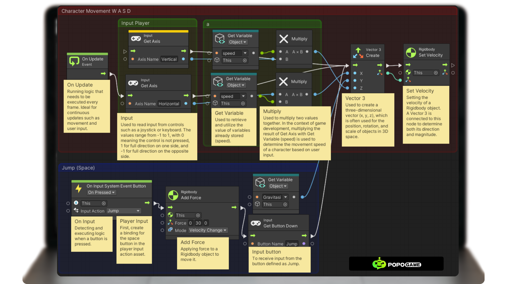

After that, save and run your program. You don't need to close the visual scripting tab because you can see any errors if your program doesn't run as expected.

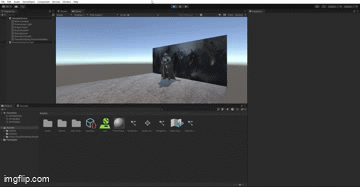
